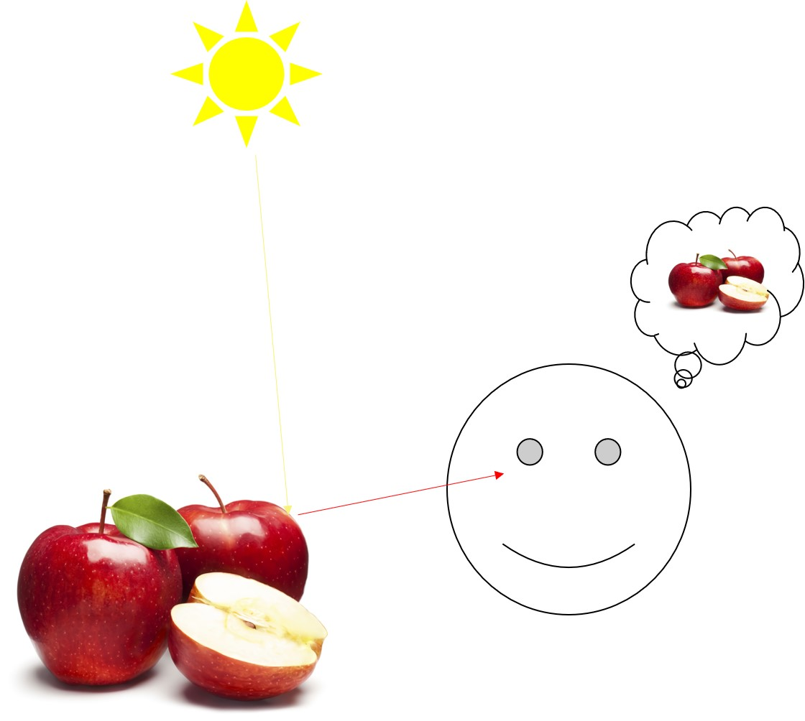
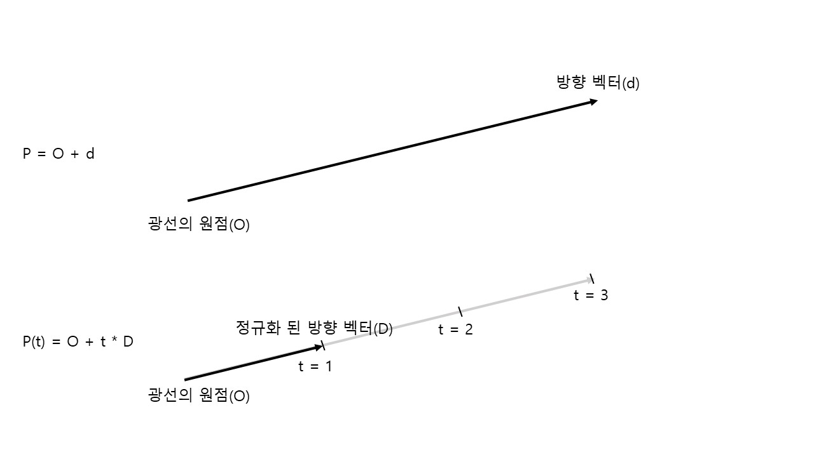
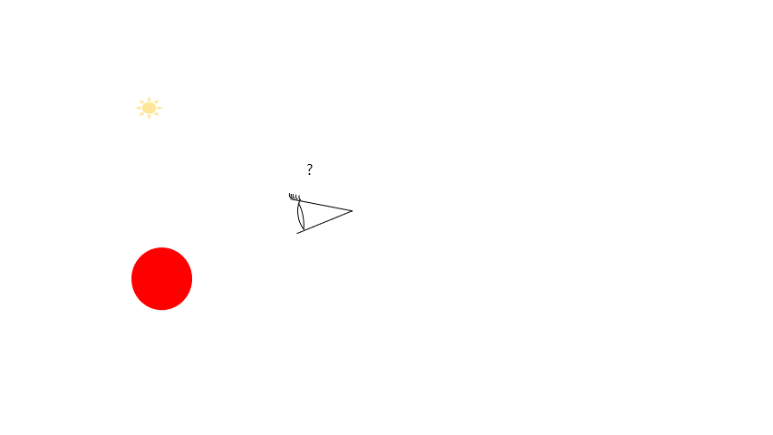
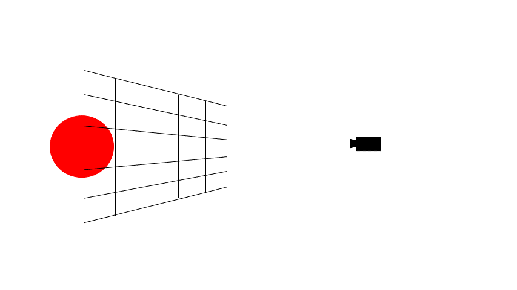
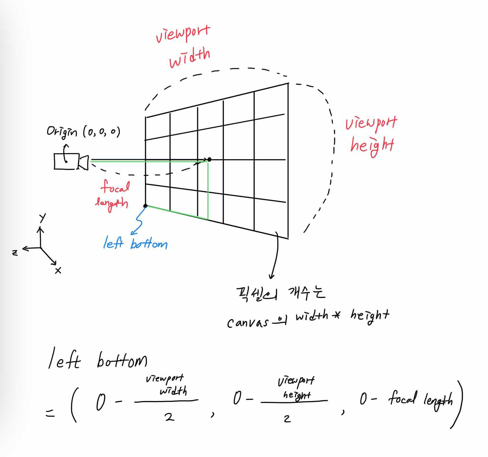

# 3. 레이, 카메라

이번 장에서는 '레이'트레이싱의 **_레이_** , '레이'의 출발점이 되는 **_카메라_** 에 대해 알아볼 것이다.

### 들어가기 전에

우리는 오른손 [좌표계](https://www.scratchapixel.com/lessons/mathematics-physics-for-computer-graphics/geometry/coordinate-systems)를 쓸 것이다. 우리의 오른쪽 방향이 x축, 머리 위쪽 방향이 y축, 모니터에서 나오는 방향이 z축이다.

## 3.1. 실습목표

> 1. 레이에 대해 이해하고, 관련 구조체와 함수를 만든다.
>
> 2. 카메라에 대해 이해하고, 관련 함수를 만든다.
>
> 3. 레이와 카메라로 픽셀에 색상을 표현해본다.

## 3.2. 레이

다시 한 번 사과가 빨간색으로 보이는 이유에 대해 생각해보자. 광원(ex.태양)으로부터 나온 빛(태양광)이 사과와 만난 뒤, 그 중 일부(사람이 빨간색으로 느끼는 파장대에 해당하는 가시**광선**)가 사과 표면에 의해 반사되어 우리의 눈에 들어오기 때문이다(**이미지 1**).



**_이미지1_**

**광선이 우리의 눈에 들어올 때에만 물체가 보이는 것이다.** 만약 사과 뒤에 귤이 있었어도 귤은 보이지 않았을 것이다. 귤 표면에서 반사된 빛은 사과에 가로막혀 우리 눈에 들어오지 않았기 때문이다. 사과가 우리의 뒤에 있었어도 보이지 않았을 것이다. 역시 반사된 빛이 우리 눈에 들어오지 않았기 때문이다. 광선이 우리 눈에 들어와야지만 우리가 본 것으로 인식한다.

광원으로부터 나온 모든 광선이 우리 눈에 들어오는 것이 아니다(햇빛이 다른 나라에 있는 사과를 비춘다고 해서 그것이 우리 눈에 직접 보이진 않는 것처럼). 그러므로 광원으로부터 나온 **모든 광선에 대해 조사할 필요가 없다. 우리의 눈에 들어온 광선(ray)이 어떤 길을 따라 왔는지만 거꾸로 추적(tracing)하면 되는 것이다.**

우리는 3차원 좌표계에서 광선을 추적하며 그 색상을 확인할 것이다. 광선도 벡터와 같이 시작하는 점(origin)과 뻗어나가는 방향(direction)을 가지고 있다. 수식의 형태로 다시 써보면 다음과 같을 것이다.\
`P = O + d` \
`(P는 광선, O와 d는 각각 출발점과 벡터)`\
여기서 방향 벡터의 크기는 1일 수도, 그렇지 않을 수도 있다. 우리는 앞으로 방향 벡터를 1로 정규화해준 뒤 그것에 실수(t)를 곱하여 광선의 방향을 표현할 것이다.\
`P(t) = O + t * D` \
`(D는 정규화된 방향벡터)`\
위와 같이 광선을 t에 관한 매개변수 방정식으로 표현해주면, 광선의 방정식과 오브젝트(앞으로 설명할 구, 사각형 등)의 벡터 방정식을 연립하여 t의 값을 구할 수 있게 된다. 이 때 얻은 t값을 통해 광선과 벡터의 교점을 알 수 있게 되는 것이다!
(고등학교 때 배운 수학을 떠올려보자. x와 y로 표현된 직선과 원의 방정식을 연립하면 x와 y의 값을 구할 수 있고, 그 값들이 곧 교점의 좌표가 되는 것과 같은 원리다)



**_이미지2: 방정식으로 나타낸 벡터_**

코드는 다음과 같다.

```c
...
/* * * * 추가 * * * */ ; 레이 구조체
typedef struct s_ray t_ray;
...
struct  s_ray
{
    t_point3    orig;
    t_vec3      dir;
};
```

**_Code1 : [/include/structures.h]_**

```c
#ifndef TRACE_H
# define TRACE_H

# include "structures.h"
# include "utils.h"

t_ray       ray(t_point3 orig, t_vec3 dir);
t_point3    ray_at(t_ray *ray, double t);

#endif
```

**_Code2 : [/include/trace.h]_**

```c
#include "trace.h"

//ray 생성자(정규화 된 ray)
t_ray       ray(t_point3 orig, t_vec3 dir)
{
    t_ray ray;

    ray.orig = orig;
    ray.dir = vunit(dir);
    return (ray);
}

//ray origin point 부터 방향벡터 ray dir * t 만큼 떨어진 점.
t_point3    ray_at(t_ray *ray, double t)
{
    t_point3 at;

    at = vplus(ray->orig, vmult(ray->dir, t));
    return (at);
}
```

**_Code3 : [/src/trace/ray.c]_**

## 3.3. 카메라

이제 우리는 우리 **눈**에 들어온 광선이 지나온 길을 따라 광선을 역으로 추적해 나갈 것이다. 어떻게 광선을 추적할 수 있을까? **바로 우리의 눈에서 광선이 나간다고 생각을 하는 것이다.**(**이미지3**) 우리의 눈에서 나간 광선이 물체에 반사되고 반사된 광선이 광원에 도착한다면, 그 광선이 광원으로부터 출발해서 물체에 부딪히고 우리 눈에 들어왔다고 생각하는 것이다. 그리고 레이트레이싱에서 우리 눈의 역할을 하는 것이 바로 **카메라**다.



**_이미지3: 광선이 우리 눈(=카메라)에서 나간다고 생각하자_**

이제 카메라에서 광선이 출발한다고 생각해보자. 광선을 어느 방향으로 보내야 할까? 우리는 3차원 좌표계의 오브젝트를 2차원 평면의 픽셀을 통해 확인할 것이다. 이때 3차원 장면을 2차원에 투사하기 위해 사용되는 2차원 직사각형을 뷰포트(viewport)라고 한다. 뷰포트의 왼쪽 맨 위에 있는 픽셀부터 순서대로 광선을 보낼 것이다. 픽셀의 개수는 canvas의 width와 height의 곱으로 결정된다(**이미지4**).



**_이미지4: 뷰포트와 픽셀. 큰 사각형이 뷰포트, 작은 사각형이 픽셀이다._**

카메라에 필요한 구성요소(카메라의 위치, 뷰포트의 가로,세로 길이 등)를 저장해줄 구조체, 캔버스의 구성요소를 저장해줄 구조체를 만들어주자.

```c
...
// 2. 추가 (장면 구조체)
typedef struct s_camera t_camera;
typedef struct s_canvas t_canvas;
...
struct  s_camera
{
    t_point3    orig;  // 카메라 원점(위치)
    double      viewport_h; // 뷰포트 세로길이
    double      viewport_w; // 뷰포트 가로길이
    t_vec3      horizontal; // 수평길이 벡터
    t_vec3      vertical; // 수직길이 벡터
    double      focal_len; // focal length
    t_point3    left_bottom; // 왼쪽 아래 코너점
};

struct  s_canvas
{
    int     width; //canvas width
    int     height; //canvas height;
    double  aspect_ratio; //종횡비
};
```

**_Code4 : [/include/structures.h]_**

캔버스와 카메라는 모두 장면을 구성하기 위한 요소들이므로 **scene.h**를 만들어 관리해주자.

```c
#ifndef SCENE_H
# define SCENE_H

# include "structures.h"
# include "utils.h"

t_canvas    canvas(int  width, int height);
t_camera    camera(t_canvas *canvas, t_point3 origin);

#endif
```

**_Code5 : [/include/scene.h]_**

카메라와 캔버스의 생성자는 아래와 같다.

```c
#include "scene.h"

t_canvas    canvas(int  width, int height)
{
    t_canvas canvas;

    canvas.width = width;
    canvas.height = height;
    canvas.aspect_ratio = (double)width / (double)height;
    return (canvas);
}
```

**_Code6 : [/src/scene/canvas.c]_**

뷰포트는 아래 그림(**이미지5**)과 같이 설정해줄 것이다.



**_이미지5: 뷰포트 설정_**

```c
#include "scene.h"

t_camera    camera(t_canvas *canvas, t_point3 orig)
{
    t_camera    cam;
    double      focal_len;
    double      viewport_height;

    viewport_height = 2.0;
    focal_len = 1.0;
    cam.orig = orig;
    cam.viewport_h = viewport_height;
    cam.viewport_w = viewport_height * canvas->aspect_ratio;
    cam.focal_len = focal_len;
    cam.horizontal = vec3(cam.viewport_w, 0, 0);
    cam.vertical = vec3(0, cam.viewport_h, 0);
    // 왼쪽 아래 코너점 좌표, origin - horizontal / 2 - vertical / 2 - vec3(0,0,focal_length)
    cam.left_bottom = vminus(vminus(vminus(cam.orig, vdivide(cam.horizontal, 2)),
                                vdivide(cam.vertical, 2)), vec3(0, 0, focal_len));
    return (cam);
}
```

**_Code7 : [/src/scece/scene.c]_**

이제 레이를 발사할 준비가 되었으니, 카메라로부터 레이를 추적해나갈 함수를 작성하자.

## 3.4 적용

가장 처음 카메라에서 출발한 광선을 ray_primary 함수로, 레이트레이싱을 통해 픽셀의 색깔을 결정해줄 함수로 ray_color 함수를 작성해보자.

```c
...
/* * * * 추가 * * * */
t_ray       ray_primary(t_camera *cam, double u, double v);
t_color3    ray_color(t_ray *r);
...
```

**_Code8 : [/include/trace.h]_**

```c
...
/* * * * 추가 * * * */
//primary_ray 생성자
t_ray       ray_primary(t_camera *cam, double u, double v)
{
    t_ray   ray;

    ray.orig = cam->orig;
    // left_bottom + u * horizontal + v * vertical - origin 의 단위 벡터.
    ray.dir = vunit(vminus(vplus(vplus(cam->left_bottom, vmult(cam->horizontal, u)), vmult(cam->vertical, v)), cam->orig));
    return (ray);
}

//광선이 최종적으로 얻게된 픽셀의 색상 값을 리턴.
t_color3    ray_color(t_ray *r)
{
    double  t;

    t = 0.5 * (r->dir.y + 1.0);
    // (1-t) * 흰색 + t * 하늘색
    return (vplus(vmult(color3(1, 1, 1), 1.0 - t), vmult(color3(0.5, 0.7, 1.0), t)));
}
```

**_Code9 : [/src/trace/ray.c]_**

아직은 3차원 좌표에 어떠한 오브젝트도 없으므로 primary ray가 오브젝트와 만났는지 확인할 수 없다. 대신 primary ray를 표현할 벡터가 제대로 만들어졌는지 확인하기 위해 벡터의 y축 값을 이용하여 배경이 될 자연스러운 하늘을 표현해보자.

```c
...
/* * * * 추가 * * * */
#include "scene.h"
#include "trace.h"

int main(void)
{
    int         i;
    int         j;
    /* * * * 추가 * * * */
    double      u;
    double      v;
    /* * * * 추가 끝 * * * */

    t_color3    pixel_color;
    /* * * * 수정 * * * */
    t_canvas    canv;
    t_camera    cam;
    t_ray       ray;

    //Scene setting;
    canv = canvas(400, 300);
    cam = camera(&canv, point3(0, 0, 0));
    /* * * * 수정 끝 * * * */

    // 랜더링
    // P3 는 색상값이 아스키코드라는 뜻, 그리고 다음 줄은 캔버스의 가로, 세로 픽셀 수, 마지막은 사용할 색상값
    /* * * * 수정 * * * */
    printf("P3\n%d %d\n255\n", canv.width, canv.height);
    j = canv.height - 1;
    /* * * * 수정 끝 * * * */
    while (j >= 0)
    {
        i = 0;
        /* * * * 수정 * * * */
        while (i < canv.width)
        {
            u = (double)i / (canv.width - 1);
            v = (double)j / (canv.height - 1);
            //ray from camera origin to pixel
            ray = ray_primary(&cam, u, v);
            pixel_color = ray_color(&ray);
        /* * * * 수정 끝 * * * */
            write_color(pixel_color);
            ++i;
        }
        --j;
    }
}
```

**_Code10 : [/src/main.c]_**

결과물은 **이미지6**과 같다.


**_이미지6: 배경 이미지_**
