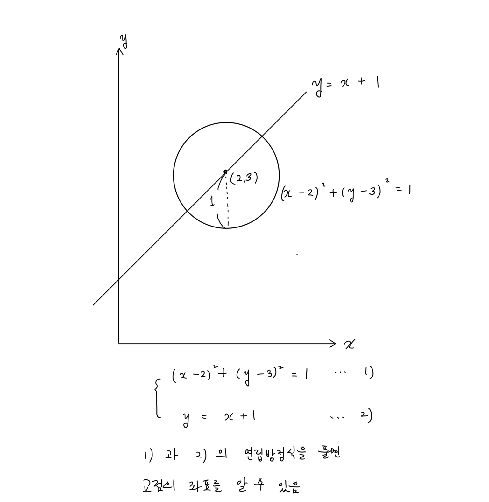
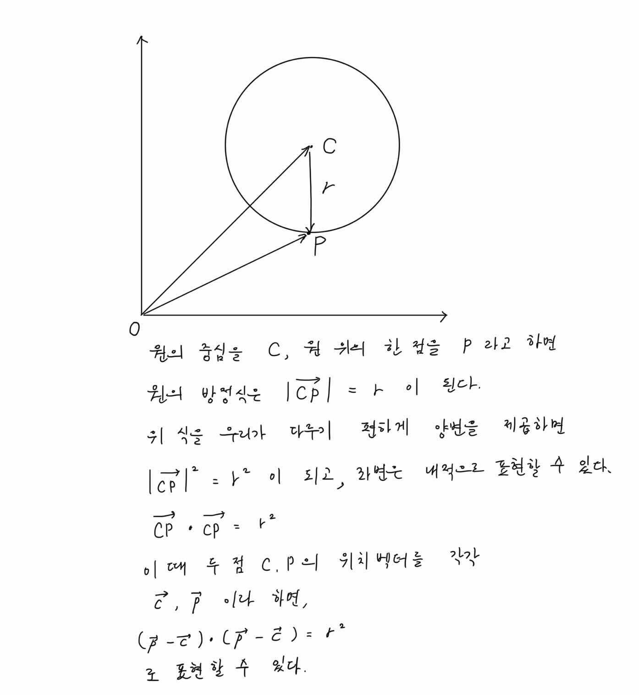
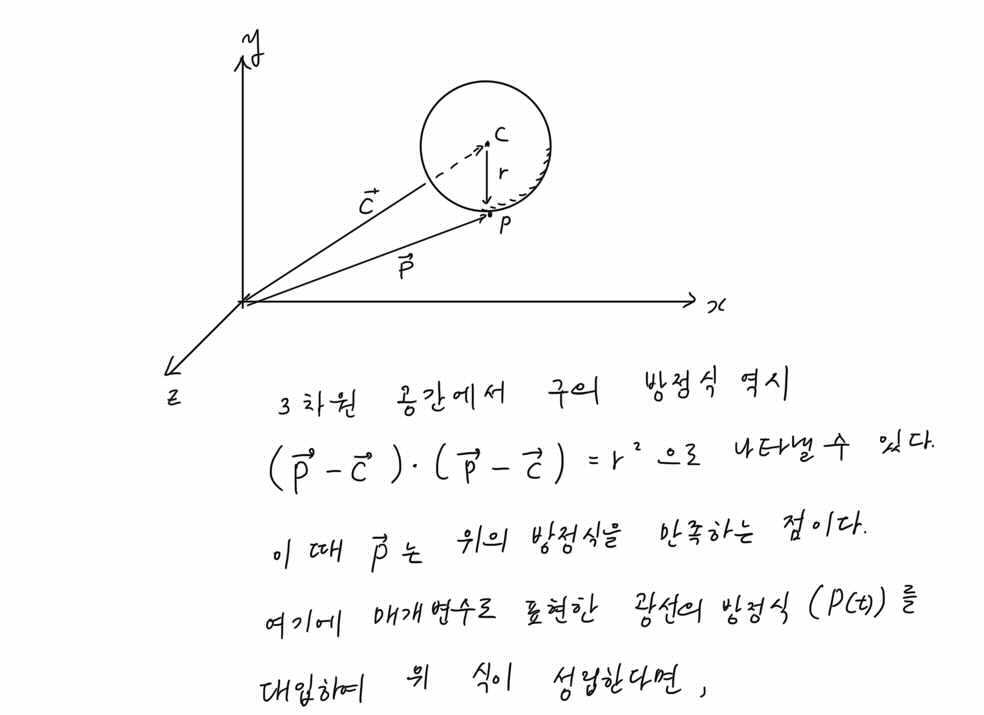
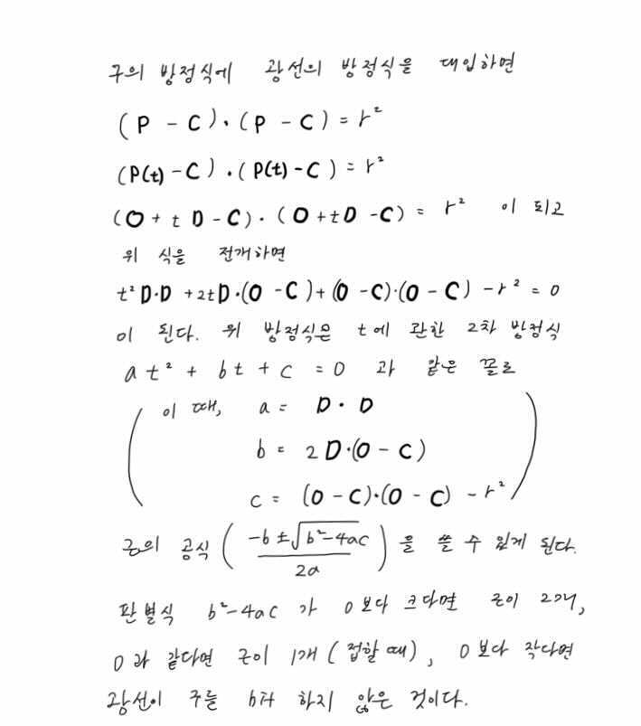

# 4. 구

우리는 3차원 공간에서 여러가지 object를 구현하는 것을 목적으로 한다. 여러가지 object 중 가장 구현하기 쉬운 구부터 구현하여 레이 트레이싱의 원리에 대해 조금 더 쉽게 접근 할 수 있도록 교재를 만들어 보았다.

---

## 4.1. 실습목표

> 1. 구의 구조체 만들기.
>
> 2. 구의 생성자 만들기.
>
> 3. hit_sphere함수 만들기
>
> 4. ray_color 수정.

---

## 4.2. 구의 구조체 만들기.

구에 대한 데이터를 저장할 구조체를 만들어준다. 구를 만들 때 필요한 것은 무엇일까?
아주 간단하다. 중심의 위치와 반지름의 길이만 알면 된다. 반지름의 제곱 값도 자주 쓰이니 반지름의 제곱도 구조체의 멤버로 추가해주자.

```c

    ...

    typedef struct s_camera t_camera;
    typedef struct s_canvas t_canvas;

    /* * * * 추가 * * * */
    // 3. 오브젝트 구조체
    typedef struct s_sphere t_sphere;


    // 4. 식별자 매크로
    typedef int             t_bool;
    # define FALSE 0
    # define TRUE 1
    /* * * * 추가 끝 * * * */

    ...

    /* * * * 추가 * * * */
    // 오브젝트 구조체
    struct  s_sphere
    {
        t_point3    center;
        double      radius;
        double      radius2;
    };
    /* * * * 추가 끝 * * * */
    #endif

```

**_Code1 : [miniRT/include/structures.h]_**

구의 구조체를 추가하고 후에 필요할 식별자 매크로를 추가해주었다.
다음은 구에 관한 정보들을 가지고 구를 만들 생성자 함수를 작성해보자.

---

## 4.3. 구의 생성자 만들기.

다음은 구의 정보들을 가지고 3차원 공간에 구를 만들어줄 생성자 함수를 만들어보자.

```c
    #include "structures.h"

    t_sphere    sphere(t_point3 center, double radius)
    {
        t_sphere sp;

        sp.center = center;
        sp.radius = radius;
        sp.radius2 = radius * radius;
        return (sp);
    }
```

**_Code2 : [miniRT/src/scene/object_create.c]_**

오브젝트를 만드는 함수는 장면을 구성할 함수이므로 scene.h에 생성자의 프로토타입을 추가해주자.

```c
    t_canvas    canvas(int  width, int height);
    t_camera    camera(t_canvas *canvas, t_point3 origin);
    /* * * * 추가 * * * */
    t_sphere    sphere(t_point3 center, double radius);
    /* * * * 추가 끝 * * * */
```

**_Code3 : [miniRT/include/scene.h]_**

구의 구조체와 구의 생성자를 추가했으니, 메인문을 수정해보자.

```c
    t_canvas    canv;
    t_camera    cam;
    t_ray       ray;
    /* * * * 추가 * * * */
    t_sphere    sp;
    /* * * * 추가 끝 * * * */
    //Scene setting;
    canv = canvas(400, 300);
    cam = camera(&canv, point3(0, 0, 0));
    /* * * * 추가 * * * */
    sp = sphere(point3(0, 0, -5), 2);
    /* * * * 추가 끝 * * * */
    // 랜더링
    // P3 는 색상값이 아스키코드라는 뜻, 그리고 다음 줄은 캔버스의 가로, 세로 픽셀 수, 마지막은 사용할 색상값
    printf("P3\n%d %d\n255\n", canv.width, canv.height);

    ...

        //ray from camera origin to pixel
        ray = ray_primary(&cam, u, v);
        /* * * * 수정 * * * */
        pixel_color = ray_color(&ray, &sp);
        /* * * * 수정 끝 * * * */
        write_color(pixel_color);
        ++i;
    }
```

**_Code4 : [miniRT/src/main.c]_**

---

## 4.4. hit_sphere함수 만들기

이제 Primary ray가 구에 닿았는지(hit 했는지)를 판단해야 한다. 광선이 뷰포트를 지나 구를 hit 했다면, 해당 픽셀을 구의 색깔로 칠해줘야 한다.

어떻게 광선이 구를 hit 했는지 판단할 수 있을까??
직선의 방정식과 원의 방정식을 떠올려보자(**이미지1**).


**_이미지1: 2차원 평면에서의 원과 직선의 방정식_**

하지만 우리는 직선의 방정식 대신 (매개변수로 표현한)광선의 벡터 방정식을 알고 있다. 구의 방정식을 벡터로 표현한 후 두 방정식을 연립하여 풀면 광선의 원점으로부터 교점 사이의 거리 t를 구할 수 있을 것이다. 구의 방정식을 어떻게 벡터로 표현할 수 있을까? 먼저 2차원 평면에서 생각해보자(**이미지2**).



**_이미지2: 벡터로 나타낸 원의 방정식_**

벡터로 나타낸 구의 방정식도 같고(**이미지3**), 구와 광선의 방정식을 연립하여 계산해보자(**이미지4**)



**_이미지3: 벡터로 나타낸 구의 방정식_**



**_이미지4: 구와 광선의 방정식을 연립해보자_**

위 식을 코드로 작성해보자.

```c
    #include "structures.h"
    #include "utils.h"

    t_bool      hit_sphere(t_sphere *sp, t_ray *ray)
    {
        t_vec3  oc; //방향벡터로 나타낸 구의 중심.
        //a, b, c는 각각 t에 관한 2차 방정식의 계수
        double  a;
        double  b;
        double  c;
        double  discriminant; //판별식

        oc = vminus(ray->orig, sp->center);
        a = vdot(ray->dir, ray->dir);
        b = 2.0 * vdot(oc, ray->dir);
        c = vdot(oc, oc) - sp->radius2;
        // discriminant 는 판별식
        discriminant = b * b - 4 * a * c;

        // 판별식이 0보다 크다면 광선이 구를 hit한 것!
        return (discriminant > 0);
    }
```

**_Code5 : [miniRT/src/trace/hit/hit_sphere.c]_**

---

## 4.5. ray_color 수정.

이제 hit_sphere 함수를 ray_color에 반영해주자.

```c
...

    //광선이 최종적으로 얻게된 픽셀의 색상 값을 리턴.
    /* * * * 수정 * * * */
    t_color3    ray_color(t_ray *ray, t_sphere *sphere)
    {
        double  t;

        if (hit_sphere(sphere, ray))
            return (color3(1, 0, 0));
        else
        {
            //ray의 방향벡터의 y 값을 기준으로 그라데이션을 주기 위한 계수.
            t = 0.5 * (ray->dir.y + 1.0);
            // (1-t) * 흰색 + t * 하늘색
            return (vplus(vmult(color3(1, 1, 1), 1.0 - t), vmult(color3(0.5, 0.7, 1.0),     t)));
        }
    /* * * * 수정 끝 * * * */
    }
```

**_Code6 : [miniRT/src/trace/ray.c → miniRT/src/trace/ray/ray.c]_**

구를 hit한 경우에는 빨간색을(albedo; 1, 0, 0), hit하지 못한 경우에는 배경인 하늘색을 표현하도록 수정했다.

hit_sphere 역시 tracing과 관련된 함수이므로 trace.h에 함수의 선언부를 추가해주자.

```c
    # include "structures.h"
    # include "utils.h"
    /* * * * 추가 * * * */
    // trace/ray/
    /* * * * 추가 끝 * * * */
    t_ray       ray(t_point3 orig, t_vec3 dir);
    t_ray       ray_primary(t_camera *cam, double u, double v);
    t_point3    ray_at(t_ray *ray, double t);
    /* * * * 수정 * * * */
    t_color3    ray_color(t_ray *ray, t_sphere *sphere);

    // trace/hit/
    t_bool      hit_sphere(t_sphere *sp, t_ray *ray);
    /* * * * 수정 끝 * * * */
    #endif

```

**_Code7 : [miniRT/include/trace.h]_**

결과물은 다음과 같다(**이미지5**).


**_이미지5_**
