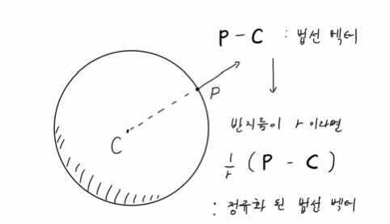

# 5. 법선

법선은 물체 표면과 빛의 상호작용을 계산하는데 필수적이다. 이번 장에서는 법선에 대해 알아보자.

## 5.1. 실습목표

> 1. primary ray와 구가 만난 점에서의 법선을 구한다.
>
> 2. 법선의 x, y, z값을 이용해 구의 색깔을 바꿔본다.

## 5.2. 구와 광선의 교점 구하기.

전 장에서 구의 중심 좌표와 primary ray를 이용해 구의 방정식을 세웠고, 방정식을 t에 관한 2차 방정식으로 바꾼뒤 t^2^과 t의 계수, 상수에 해당하는 a, b, c값을 구했다. 이번 장에서는 근의 공식을 이용하여 t값을 구하고, 구와 primary ray의 정확한 교점을 구할 것이다.

hit_sphere에서 t값을 반환할 것이므로 먼저 반환 타입을 바꿔주자.

```c
...
/* * * * 수정 * * * */
double      hit_sphere(t_sphere *sp, t_ray *ray);
/* * * * 수정 끝 * * * */
```

**_Code1 : [/include/trace.h]_**

```c
#include "structures.h"
#include "utils.h"

//t_bool에서 double로 변환.
double      hit_sphere(t_sphere *sp, t_ray *ray)
{
    ...
    discriminant = b * b - 4 * a * c;

    /* * * * 수정 * * * */
    if (discriminant < 0) // 판별식이 0보다 작을 때 : 실근 없을 때,
        return (-1.0);
    else
        return ((-b - sqrt(discriminant)) / (2.0 * a)); // 두 근 중 작은 근
    /* * * * 수정 끝 * * * */
}
```

**_Code1 : [/src/trace/hit/hit_sphere.c]_**

## 5.3. 법선 구하기

구와 광선의 교점, 구의 중심을 알게 됐으니 법선은 쉽게 구할 수 있다 (**이미지1**). 교점에서 중심을 빼준 뒤 구의 반지름으로 나눠주면 정규화된 법선을 구할 수 있다.



**_이미지1 : 구 표면에서의 법선_**

ray_color 함수를 수정하여 법선을 구하고, 법선을 이용하여 구에 색깔을 입혀보자.

```c
t_color3    ray_color(t_ray *ray, t_sphere *sphere)
{
    double  t;
    /* * * * 추가 * * * */
    t_vec3  n;
    /* * * * 추가 끝 * * * */

    /* * * * 수정 * * * */
    //광선이 구에 적중하면(광선과 구가 교점이 있고, 교점이 카메라 앞쪽이라면!)
    t = hit_sphere(sphere, ray);
    if (t > 0.0)
    {
        //정규화 된 구 표면에서의 법선
        n = vunit(vminus(ray_at(ray, t), sphere->center));
        return (vmult(color3(n.x + 1, n.y + 1, n.z + 1), 0.5));
    }
    /* * * * 수정 끝 * * * */
    ...
}
```

**_Code2 : [src/trace/ray/ray.c]_**

n은 정규화된 법선이므로 x, y, z 값이 모두 [-1, 1]의 범위 안에 있다. 우리가 구하고자 하는 범위는 [0, 1]이므로 각각의 값에 1을 더해 범위를 [0, 2]로 변환한 뒤 2로 나눠주어 범위를 [0, 1]로 매핑했다.

위와 같이 수정한 후 결과 이미지는 다음과 같다(**이미지2**).


**_이미지2_**
