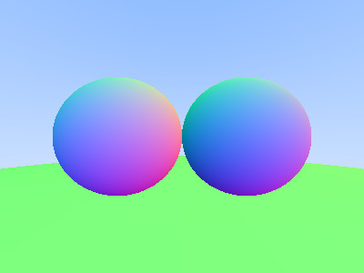

# 7. 오브젝트

이번 장에서는 여러가지 오브젝트(도형)들을 하나의 오브젝트로 다루기 위해 object라는 리스트를 만드려고 한다.

## 7.1. 실습목표

> 1.  object 리스트에 대해 알아보고 리스트를 만든다. 이 전에 만든 함수들을 object 리스트에 맞게 수정한다.

## 7.2. object

6단원까지는 sphere 하나의 object를 구현하고 저장하였지만 앞으로 여러가지의 object를 추가할 수 있게 하기 위해서 코드의 수정이 필요하다. 우선 여러가지의 object를 저장할 수 있어야하고 그 object들을 한번에 가지고 다닐 수 있어야한다. ray는 여러개의 object 중 가장 가까이에 있는 object에 히트를 해야한다.

우리는 object라는 리스트를 만들어 각 도형의 정보를 저장할 것이다. 그리고 기존에 sphere에만 적용 가능했던 함수들을 조금씩 손봐줄 예정이다.

먼저 다음과 같은 구조체를 만들어서 structures.h에 추가해주자.

```c
...

// 3. 오브젝트 구조체
/* * * * 추가 * * * */
typedef struct s_object t_object;
/* * * * 추가 끝 * * * */
typedef struct s_sphere t_sphere;

...

# define FALSE 0
# define TRUE 1
/* * * * 추가 * * * */
typedef int             t_object_type;
# define SP 0
/* * * * 추가 끝 * * * */

...

// 오브젝트 구조체
/* * * * 추가 * * * */
struct                      s_object
{
    t_object_type   type;
    void            *element;
    void            *next;
};
/* * * * 추가 끝 * * * */

#endif
```

**_Code1 : [miniRT/include/structures.h]_**

Object 리스트 안에 type은 object 리스트를 봤을 때 현재 리스트가 가리키는 도형이 무엇인지 바로 알 수 있기 위해 추가하였다. 그리고 우리는 sphere라는 도형은 매크로 SP로 type을 지정했다. 리스트의 element에 각 도형의 데이터를 저장할 것이다.

## 7.3. object 적용

object 리스트를 구현했으니 hit함수를 추가하여 object를 받을 수 있게 하자. 그리고 ray_color와 hit_sphere도 t_sphere에만 한정되지 않는 함수로 바꾸어 주자.

```c
    t_point3    ray_at(t_ray *ray, double t);
    /* * * * 추가 * * * */
    t_color3    ray_color(t_ray *ray, t_object *world); /* * * * 수정 * * * */.

    // trace/hit/
    t_bool      hit(t_object *obj, t_ray *ray, t_hit_record *rec);
    t_bool      hit_obj(t_object *obj, t_ray *ray, t_hit_record *rec);
    t_bool      hit_sphere(t_object *world, t_ray *ray, t_hit_record *rec);
    /* * * * 추가 끝 * * * */
    ...
```

**_Code2 : [miniRT/include/trace.h]_**

```c
/* * * * 추가 * * * */
#include "trace.h"

t_bool      hit(t_object *world, t_ray *ray, t_hit_record *rec)
{
    t_bool          hit_anything;
    t_hit_record    temp_rec;

    temp_rec = *rec; // temp_rec의 tmin, tmax 값 초기화를 위해.
    hit_anything = FALSE;
    while(world)
    {
        if (hit_obj(world, ray, &temp_rec))
        {
            hit_anything = TRUE;
            temp_rec.tmax = temp_rec.t;
            *rec = temp_rec;
        }
        world = world->next;
    }
    return (hit_anything);
}

// hit_obj는 오브젝트 타입에 맞는 hit함수로 연결해주는 관문
t_bool      hit_obj(t_object *world, t_ray *ray, t_hit_record *rec)
{
    t_bool  hit_result;

    hit_result = FALSE;
    if (world->type == SP)
        hit_result = hit_sphere(world, ray, rec); //hit_sphere의 첫번째 인자도 t_sphere *에서 t_object *로 수정해주자.
    return (hit_result);
}
/* * * * 추가 끝 * * * */
```

**_Code3 : [miniRT/src/trace/hit/hit.c]_**

각 object를 순회하며 ray를 맞았는지 확인하기 위하여 hit라는 함수를 만들어 준다. 우리는 여러가지 오브젝트가 존재할 때에 더 가까이 있는 오브젝트를 히트해야한다. 그러므로 어떠한 오브젝트에 히트하면 tmax를 히트한 t로 바꾸어 그 다음 오브젝트를 검사할 때에 더 멀리 있는 오브젝트일 경우 히트가 안되게 했다.

hit_obj에서는 리스트에 어떤 object가 저장되어 있는지 확인한 후 각각의 object에 맞는 함수를 실행할 수 있게 분기해주었다.

각 sphere와 object를 초기화 할 수 있는 함수를 만들어 보자.

```c
/* * * * 수정 * * * */
#include "scene.h"

t_object    *object(t_object_type type, void *element)
{
    t_object    *new;

    if (!(new = (t_object *)malloc(sizeof(t_object))))
        return (NULL);
    new->type = type;
    new->element = element;
    new->next = NULL;
    return (new);
}

t_sphere    *sphere(t_point3 center, double radius)
{
    t_sphere *sp;

    if(!(sp = (t_sphere *)malloc(sizeof(t_sphere))))
        return (NULL);
    sp->center = center;
    sp->radius = radius;
    sp->radius2 = radius * radius;
    return (sp);
}
/* * * * 수정 끝 * * * */
```

**_Code4: [miniRT/src/scene/object_create.c]_**

`object`함수는 리스트에 추가할 object를 만드는 생성자이다. 그리고 sphere는 sphere의 데이터를 저장하는 함수이다.
`sphere`함수로 만든 구조체가 object의 element에 들어가는 것이다.
`object`함수와 `sphere`함수 모두 장면을 구성하는 함수이므로 scene.h 파일에 추가해주자.

```c
...
/* * * * 추가 * * * */
t_object    *object(t_object_type type, void *element);
/* * * * 추가 끝 * * * */
t_sphere    *sphere(t_point3 center, double radius);
```

**_Code5: [miniRT/include/scene.h]_**

이제 `object`함수로 만든 오브젝트들을 오브젝트 리스트에 추가할 함수들을 만들어주자.

```c
#include "utils.h"

void        oadd(t_object **list, t_object *new)
{
    t_object    *cur;

    if (*list == NULL)
    {
        *list = new;
        return ;
    }
    cur = *list;
    while (cur->next)
        cur = cur->next;
    cur->next = new;
}

t_object    *olast(t_object *list)
{
    if (list == NULL)
        return (NULL);
    while (list->next)
        list = list->next;
    return (list);
}
```

**_Code6: [miniRT/src/utils/object_utils.c]_**

각각 리스트 추가, 리스트의 마지막으로 이동하는 함수들이다. 위 함수들을 `utils.h`에 추가해주자.

```c
...

/* * * * 추가 * * * */
// 오브젝트 유틸리티
void        oadd(t_object **list, t_object *new);
t_object    *olast(t_object *list);
/* * * * 추가 끝 * * * */

#endif
```

**_Code7: [miniRT/include/utils.h]_**

t_sphere를 바로 사용하던 ray_color를 수정해주자.

```c
// 광선이 최종적으로 얻게된 픽셀의 색상 값을 리턴.
/* * * * 수정 * * * */
t_color3    ray_color(t_ray *ray, t_object *world)
/* * * * 수정 끝 * * * */
{
    double          t;
    t_vec3          n;

  ...

    rec.tmin = 0;
    rec.tmax = INFINITY;
    //광선이 구에 적중하면(광선과 구가 교점이 있고, 교점이 카메라 앞쪽이라면!)
    /* * * * 수정 * * * */
    if (hit(world, ray, &rec))
    /* * * * 수정 끝 * * * */
        return (vmult(vplus(rec.normal, color3(1, 1, 1)), 0.5));

```

**_Code8: [miniRT/src/trace/ray/ray.c]_**

sphere구조체를 받던 함수를 object를 받게 바꾸었다.

바뀐 구조를 적용하여 main을 수정해보자.

```c
    t_canvas    canv;
    t_camera    cam;
    t_ray       ray;
    /* * * * 수정 * * * */
    t_object    *world;
    /* * * * 수정 끝 * * * */

    //Scene setting;
    canv = canvas(400, 300);
    cam = camera(&canv, point3(0, 0, 0));
    /* * * * 수정 * * * */
    world = object(SP, sphere(point3(-2, 0, -5), 2)); // world 에 구1 추가
    oadd(&world, object(SP, sphere(point3(2, 0, -5), 2))); // world 에 구2 추가
    oadd(&world, object(SP, sphere(point3(0, -1000, 0), 990))); // world 에 구3 추가
    /* * * * 수정 끝 * * * */
    // 랜더링

...

    //ray from camera origin to pixel
    ray = ray_primary(&cam, u, v);
    /* * * * 수정 * * * */
    pixel_color = ray_color(&ray, world);
    /* * * * 수정 끝 * * * */
    write_color(pixel_color);
```

**_Code9: [miniRT/src/main.c]_**

기존 sphere를 추가하는 부분에서 object를 추가하고 그 곳에 sphere를 추가하는 코드로 변경했다.

지금까지 코드를 수정한 결과는 다음과 같다(**이미지1**).



**이미지1**
