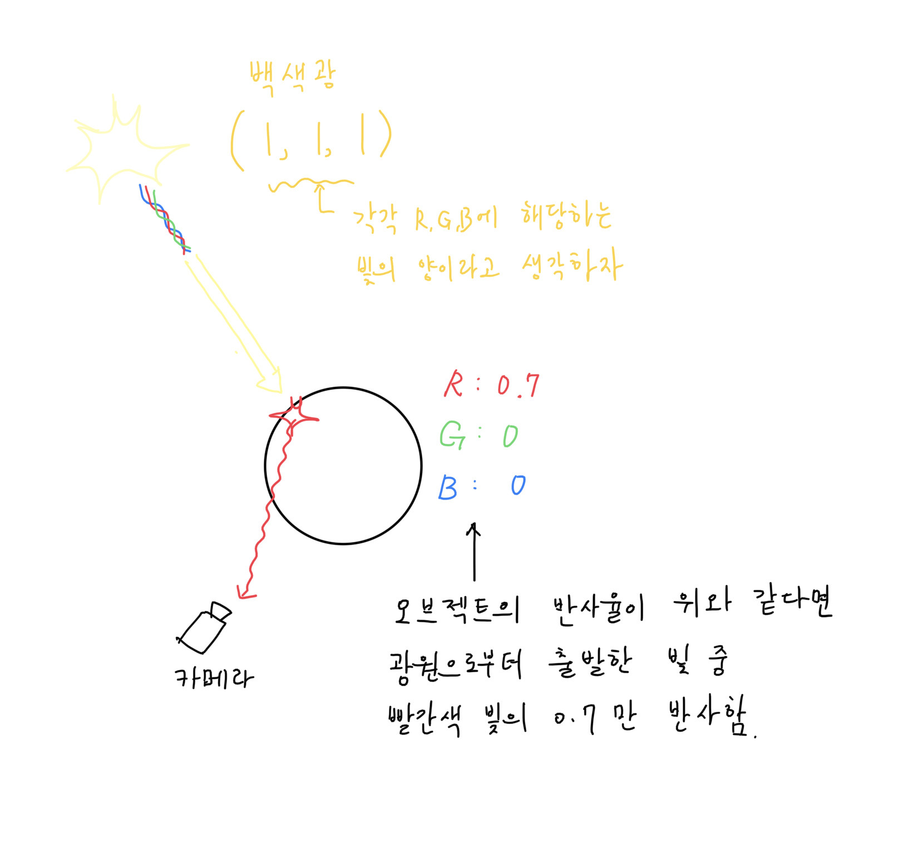
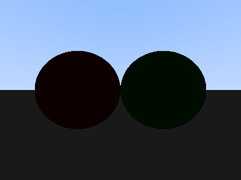
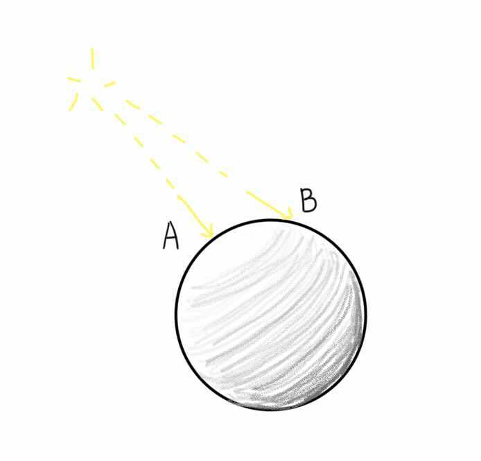
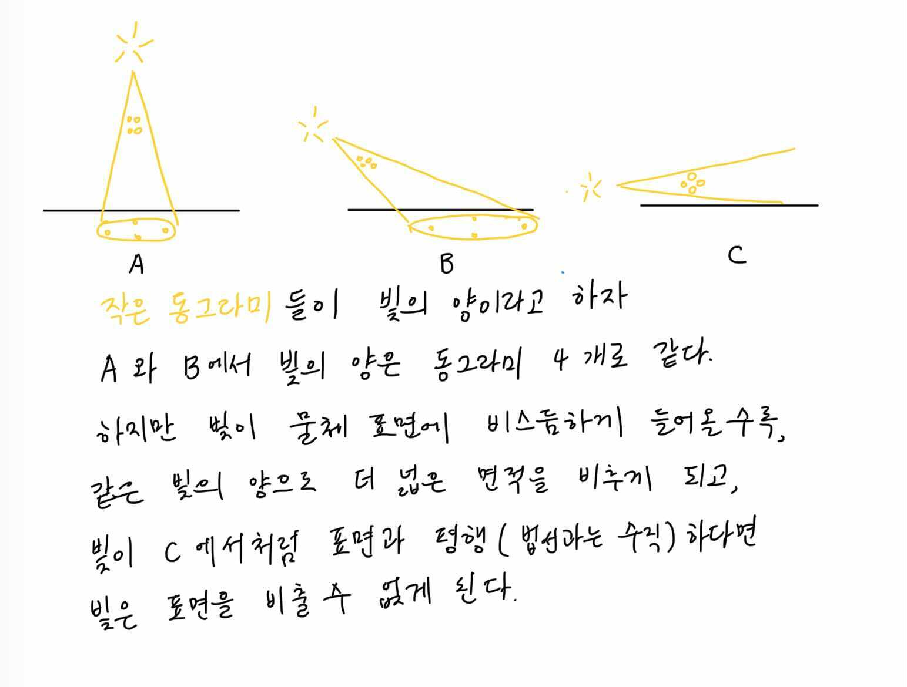
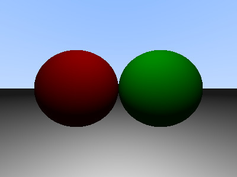
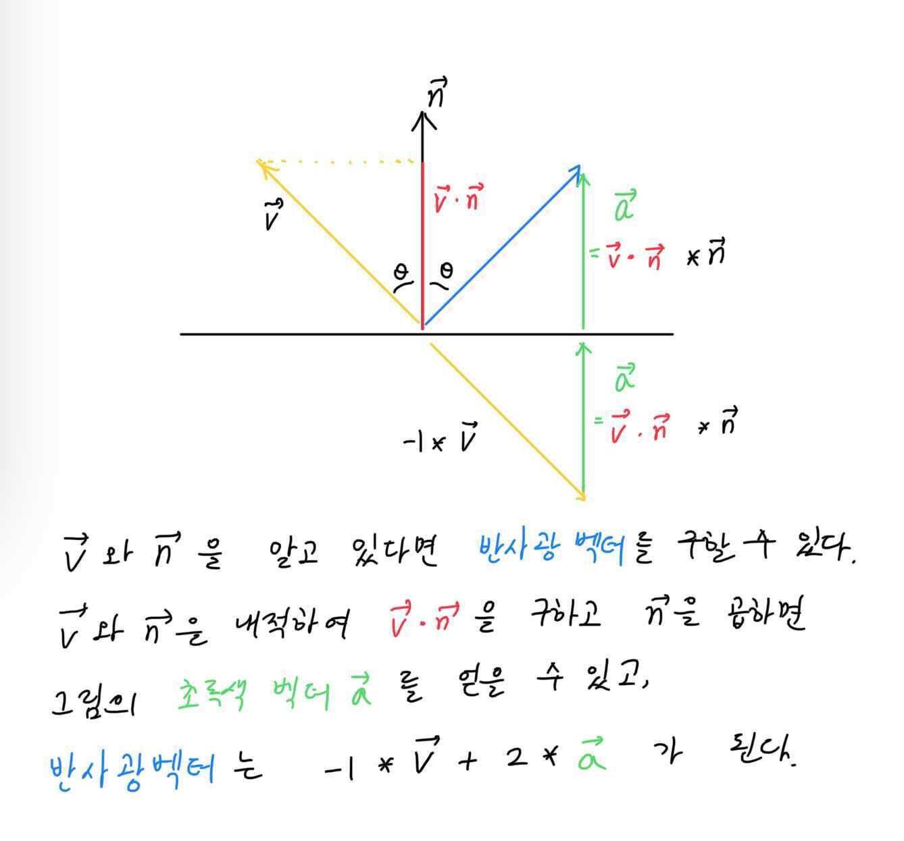
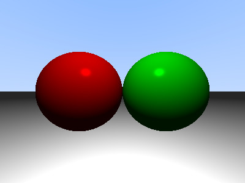

# 8. Phong lighting

드디어 오브젝트에 색을 입히고, 빛을 고려해주는 단계에 들어섰다...

## 8.1. 실습목표

> 1.  light 구조체/ light 생성자 만들기
> 2.  light를 관리할 오브젝트 리스트 만들기
> 3.  phong_lighting에 대한 학습 및 적용
> 4.  scene 구조체 정의

## 8.1.1. ray tracing?

이번 장에서 우리는 **빛**을 고려할 것이다. 3차원 공간에 **광원**을 놓고, 광원으로부터 나온 빛이 **오브젝트에 미치는 영향**을 계산할 것이다.

광원 하나에서 백색광이 나온다고 생각해보자. 백색광을 [1, 0]으로 매핑된 RGB로 표현한다면 (1, 1, 1)이 될 것이다. 광원으로부터 출발한 백색광이 반사율(=albedo) (0.7, 0, 0)인 구에 반사되어 우리 눈에 들어온다면, (1, 1, 1) 중 G와 B에 해당하는 1은 구에 흡수될 것이고 R에 해당하는 1 중 70퍼센트만 반사되어 우리 눈에 들어올 것이다(**이미지1**).


**_이미지1: 빛이 물체에 반사되어 눈에 들어오는 과정_**

백색광(1, 1, 1)이 하나 더 있다면, 교점에 들어오는 광량은 (2, 2, 2)이 될 것이고 오브젝트는 (1.4, 0, 0)를 반사할 것이다(RGB값을 [0, 1]로 매핑했으므로 1을 초과하는 값은 1이 되겠지만 말이다). 반대로 공간 안에 광원이 하나도 없다면 오브젝트는 반사할 빛이 없으므로 검은색일 것이다(밤에 불꺼진 방에서 아무것도 보이지 않듯이).

광원의 개수 말고도 오브젝트가 어떻게 보일지 영향을 미치는 요소가 더 있다. 실제 상황을 생각해보자. 먼저 광원과 오브젝트 사이의 거리가 영향을 미칠 것이다. 물체의 표면이 어떤 재질인지, 정반사를 하는지, 난반사를 하는지도 영향을 미칠 것이다. 또한 다른 물체에 반사되어 들어온 빛, 대기 중의 입자에 의해 산란되어 들어온 빛, 투명한 물체에 의해 굴절되어 들어온 빛 등 다양한 요소들이 있다. 이렇게 우리의 눈(또는 카메라)에 들어온 모든 빛을 고려하는 렌더링 기법이 ray tracing이다.

실제 상황처럼 모든 상호작용을 고려하면 렌더링된 이미지는 점점 더 정확해진다. 이렇게 모든 요소를 고려하기 위해서는 빛의 물리학을 점점 더 자세하게 알아야 한다(실제로 렌더링은 물리학의 원리에 따라 발전하고 있고, 에너지 보존 법칙과 같은 물리 법칙들이 반영되어 있다). 하지만 이 교재는 렌더링을 처음 접하는 사람들을 위해 만들어졌다. 그러므로 우리는 레이트레이싱이 아닌 **퐁 조명 모델**을 사용한다.

## 8.1.1. Phong lighting?

퐁 조명 모델은 보다 간단한 물리 법칙에 기반한다. 퐁 조명 모델도 광선을 추적한다. 하지만 딱 한 단계, 광원에서 빛이 나와서 물체에 반사되어 눈에 들어오는 단계만 수학적으로 계산한다. 퐁 조명 모델에 사용되는 중요한 물리학적 기법은 퐁 반사 모델이다. 퐁 반사 모델은 광원에서 나온 빛이 물체에 반사되어 나올 때, 그 조도가 어느 정도가 되는지를 구하는 데에 활용되는 모델이다.

퐁 반사 모델은 조도를 구할 때 세 가지 요소를 고려한다. ambient lighting, diffuse lighting, specular lighting. 세 가지 조명은 다음과 같다.

> ambient lighting(주변 조명) : 밝은 낮 어두운 그늘에 들어가도 물체가 보이는 것처럼, 공기 중에 산란되어 존재하는 빛으로 인해 물체가 밝아지는 것을 묘사함(**이미지2**의 첫 번째 그림).
> diffuse lighting(확산 조명) : 난반사의 역할. 광선이 물체에 비스듬하게 들어올 수록 단위 면적 당 들어오는 광선의 수가 적다는 논리로, **이미지2**의 두 번째 그림과 같은 결과를 출력함
> specular lighting(반사광) : 정반사의 역할로 **이미지2**의 세 번째 그림과 같은 결과를 출력함.
>
> 위 세 가지 요소를 모두 결합하면 가장 오른쪽에 있는 결과가 나온다.


**_이미지2: [출처](https://learnopengl.com/Lighting/Basic-Lighting)_**

각각의 요소를 계산하는 방법과 코드는 이번 장의 4번째 섹션([8.4. phong lighting](#8.4.-phong-lighting-model))을 참고하자.

## 8.2. albedo추가 /light 구조체/ light 생성자/ light 리스트

### 8.2.1 광원

광원에는 기본적으로 [**평행광원**(Direct lighting ex.태양) **점광원**(Point light) **집중광원**(Spot light)](https://heinleinsgame.tistory.com/19)이 있는데 이번 장에서는 **점광원**만을 다룬다.
먼저 광원의 원점, 광원의 색, 밝기 정보를 담을 t_light 구조체를 정의해주고, 점광원(light_point)의 오브젝트 타입 식별자 메크로를 정의해준다.

```c
typedef struct s_object t_object;
typedef struct s_sphere t_sphere;
/* * * * 추가 * * * */
typedef struct s_light  t_light;
/* * * * 추가 끝 * * * */

...

typedef int t_object_type;
# define SP 0
/* * * * 추가 * * * */
# define LIGHT_POINT 1
/* * * * 추가 끝 * * * */

...

struct      s_sphere
{
    t_point3    center;
    double      radius;
    double      radius2;
};

/* * * * 추가 * * * */
struct      s_light
{
    t_point3    origin;
    t_color3    light_color;
    double      bright_ratio;
};
/* * * * 추가 끝 * * * */
```

**_Code1 : [miniRT/include/structures.h]_**

light 구조체 생성자도 만들어 주자

```c
...

t_sphere    *sphere(t_point3 center, double radius)
{
    t_sphere *sp;
    if(!(sp = (t_sphere *)malloc(sizeof(t_sphere))))
        return (NULL);
    sp->center = center;
    sp->radius = radius;
    sp->radius2 = radius * radius;
    return (sp);
}

/* * * * 추가 * * * */
t_light     *light_point(t_point3 light_origin, t_color3 light_color, double bright_ratio)
{
    t_light *light;

    if(!(light = (t_light *)malloc(sizeof(t_light))))
        return (NULL);
    light->origin = light_origin;
    light->light_color = light_color;
    light->bright_ratio = bright_ratio;
    return (light);
}
/* * * * 추가 끝 * * * */
```

**_Code2 : [miniRT/src/scene/object_create.c]_**

`light_point`함수의 선언부를 scene.h에 추가해주자.

```c
...
/* * * * 추가 * * * */
t_light     *light_point(t_point3 light_origin, t_color3 light_color, double bright_ratio);
...
```

**_Code3 : [miniRT/include/scene.h]_**

### 8.2.2. 반사율

광원과 오브젝트의 상호작용을 통해 픽셀의 색상을 얻어오기 위해 `t_object` 구조체와 `t_hit_record` 구조체에 반사율(albedo) 멤버를 추가해준다.

```c
...
/* * * * 추가 * * * */
typedef struct  s_hit_record    t_hit_record;
typedef struct  s_object    t_object;
/* * * * 추가 끝 * * * */
...
struct s_hit_record
{
    t_point3    p;
    t_vec3      normal;
    t_bool      front_face;
    double      tmin;
    double      tmax;
    double      t;
    t_bool      front_face;
    /* * * * 추가 * * * */
    t_color3    albedo;
    /* * * * 추가 끝 * * * */
};

...
struct                      s_object
{
    t_object_type   type;
    void            *element;
    void            *next;
    /* * * * 추가 * * * */
    t_color3        albedo;
    /* * * * 추가 끝 * * * */
};
```

**_Code4 : [miniRT/include/structures.h]_**

오브젝트 생성자에도 반사율(albedo) 인자를 추가해준다.

```c
#include "scene.h"
/* * * * 수정 * * * */
t_object    *object(t_object_type type, void *element, t_color3 albedo)
/* * * * 수정 끝 * * * */
{
    t_object    *new;

    if (!(new = (t_object *)malloc(sizeof(t_object))))
        return (NULL);
    new->type = type;
    new->element = element;
    new->next = NULL;
    /* * * * 추가 * * * */
    new->albedo = albedo;
    /* * * * 추가 끝 * * * */
    return (new);
}
```

**_Code5 : [miniRT/src/scene/object_create.c]_**

헤더 파일도 수정해준다.

```c

...
/* * * * 수정 * * * */
t_object    *object(t_object_type type, void *element, t_color3 albedo);
/* * * * 수정 끝 * * * */
```

**_Code6 : [miniRT/include/scene.h]_**

`hit_sphere` 함수도 hit_record에 albedo를 기록할 수 있도록 수정해준다.

```c
/* * * * 수정 * * * */
t_bool      hit_sphere(t_object *sp_obj, t_ray *ray, t_hit_record *rec)
/* * * * 수정 끝 * * * */
{
    /* * * * 추가 * * * */
    t_sphere    *sp;
    /* * * * 추가 끝 * * * */
    t_vec3      oc;
    double      a;
    double      half_b;
    double      c;
    double      discriminant; //판별식
    double      sqrtd;
    double      root;

    /* * * * 추가 * * * */
    sp = sp_obj->element;
    /* * * * 추가 끝 * * * */

    ...

    /* * * * 추가 * * * */
    rec->albedo = sp_obj->albedo;
    /* * * * 추가 끝 * * * */
    return (TRUE);
}

```

**_Code7 : [miniRT/src/trace/hit/hit_sphere.c]_**

## 8.3. 장면 설정

지금 까지는 장면에 존재하는 오브젝트의 리스트는 `t_object *world`변수 뿐이였지만 여러 광원을 다루기 위해 별도의 오브젝트 리스트 `t_object *lights`가 하나 더 필요해졌다.

기존 함수에 인자로 추가해 줄 수도 있겠지만, 이 쯤에서 함수들의 인자가 더 늘어나는 것을 막기 위해, 장면의 데이터(카메라, 캔버스, 물체 리스트, 광원 리스트 ...)를 통합하여 관리할 수 있는 scene 구조체를 만들고 기존 코드를 한번 정리하고 가보자.

```c
...

struct  s_canvas
{
    int         width; //canvas width
    int         height; //canvas height;
    double          aspect_ratio; //종횡비
};

/* * * * 추가 * * * */
struct  s_scene
{
    t_canvas        canvas;
    t_camera        camera;
    t_object        *world;
    t_object        *light;
    t_color         ambient; // 8.4에서 설명할 요소
    t_ray           ray;
    t_hit_record    rec;
};
/* * * * 추가 끝 * * * */
```

**_Code8 : [miniRT/include/structures.h]_**

`t_scene *scene` 변수의 데이터를 설정해주는 `scene_init()`함수를 정의하고, main 함수의 코드를 수정해보자.

```c
#include "print.h"
#include "trace.h"

/* * * * 추가 * * * */
t_scene *scene_init(void)
{
    t_scene     *scene;
    t_object    *world;
    t_object    *lights;
    double      ka; // 8.4 에서 설명

    // malloc 할당 실패 시, 실습에서는 return NULL로 해두었지만, 적절한 에러 처리가 필요하다.
    if(!(scene = (t_scene *)malloc(sizeof(t_scene))))
        return (NULL);
    scene->canvas = canvas(400, 300);
    scene->camera = camera(&scene->canvas, point3(0, 0, 0));
    world = object(SP, sphere(point3(-2, 0, -5), 2), color3(0.5, 0, 0)); // world 에 구1 추가
    oadd(&world, object(SP, sphere(point3(2, 0, -5), 2), color3(0, 0.5, 0))); // world 에 구2 추가
    oadd(&world, object(SP, sphere(point3(0, -1000, 0), 999), color3(1, 1, 1))); // world 에 구3 추가
    scene->world = world;
    lights = object(LIGHT_POINT, light_point(point3(0, 5, 0), color3(1, 1, 1), 0.5), color3(0, 0, 0)); // 더미 albedo
    scene->light = lights;
    ka = 0.1; // 8.4 에서 설명
    scene->ambient = vmult(color(1,1,1), ka); // 8.4 에서 설명
    return (scene);
}
/* * * * 추가 끝 * * * */

int     main(void)
{
    int         i;
    int         j;
    double      u;
    double      v;
    t_color3    pixel_color;
    /* * * * 수정 * * * */
    t_scene     *scene;

    scene = scene_init();
    // 랜더링
    // P3 는 색상값이 아스키코드라는 뜻, 그리고 다음 줄은 캔버스의 가로, 세로 픽셀 수, 마지막은 사용할 색상값
    /* * * * 수정 * * * */
    printf("P3\n%d %d\n255\n", scene->canvas.width, scene->canvas.height);
    j = scene->canvas.height - 1;
    while (j >= 0)
    {
        i = 0;
        while (i < scene->canvas.width)
        {
            u = (double)i / (scene->canvas.width - 1);
            v = (double)j / (scene->canvas.height - 1);
            //ray from camera origin to pixel
            scene->ray = ray_primary(&scene->camera, u, v);
            pixel_color = ray_color(scene);
            // ray_color함수의 인자도 ray, world를 모두 담고 있는 scene으로 바꿨다.
    /* * * * 수정 끝 * * * */
            write_color(pixel_color);
            ++i;
        }
        --j;
    }
    return (0);
}
```

**_Code9 : [miniRT/src/main.c]_**

`ray_color`함수의 인자를 `t_ray`와 `t_world`를 모두 담고 있는 `t_scene`으로 바꿨다. `ray_color`함수 내부도 수정해주자.

### 8.3.1 ray_color 업데이트

`ray_color` 함수의 인자를 `t_scene` 포인터로 변경해 주고, `t_hit_record` 변수를 초기화 해주는 함수를 `record_init`함수를 추가한다. `record_init` 함수에서 `tmin` 값을 초기화 해줄 때 0 이 아닌 **EPSILON(0.000001)** 으로 정의했는데, 이는 `double` 데이터 타입이 근사값이기 때문이다. `hit` 함수에서 `t`의 값이 0에 가까운 값이 나올 때, `tmin`이 0 이면 비교 시 hit 상황이 아닐 때도 hit로 판단하는 오차를 만들어낼 수 있기 때문에 `tmin` 값을 `EPSILON`으로 설정하여 이러한 상황을 예방할 수 있다.

```c
...

typedef int     t_object_type;
# define SP 0
# define LIGHT_POINT 1

/* * * * 추가 * * * */
# define EPSILON 1e-6 // 0.000001
/* * * * 추가 끝 * * * */
```

**_Code10 : [miniRT/include/structures.h]_**

```c

...

/* * * * 추가 * * * */
t_hit_record record_init(void)
{
    t_hit_record    record;

    record.tmin = EPSILON;
    record.tmax = INFINITY;
    return (record);
}
/* * * * 추가 끝 * * * */

/* * * * 수정 * * * */
t_color3    ray_color(t_scene *scene)
{
    double          t;
    t_vec3          n;

    //광선이 구에 적중하면(광선과 구가 교점이 있고, 교점이 카메라 앞쪽이라면!)
    scene->rec = record_init();
    if (hit(scene->world, &scene->ray, &scene->rec))
        return (phong_lighting(scene)); //phong_lighting 함수는 8.4에서 설명한다. 이제 법선 벡터를 매핑해서 얻은 색이 아닌, 앞으로 작성할 phong_lighting 함수의 결과값을 반환한다!
    else
    {
        //ray의 방향벡터의 y 값을 기준으로 그라데이션을 주기 위한 계수.
        t = 0.5 * (scene->ray.dir.y + 1.0);
        // (1-t) * 흰색 + t * 하늘색
        return (vplus(vmult(color3(1, 1, 1), 1.0 - t), vmult(color3(0.5, 0.7, 1.0), t)));
    }
}
/* * * * 수정 끝 * * * */
```

**_Code11 : [miniRT/src/trace/ray/ray.c]_**

`ray_color` 함수의 인자가 변경되었으니 `trace.h` 파일도 수정해주자.

```c
...
/* * * * 수정 * * * */
t_color3    ray_color(t_scene *scene);
/* * * * 수정 끝 * * * */
...
```

**_Code12: [miniRT/include/trace.h]_**

---

## 8.4. Phong lighting model

> 이번 챕터는 Phong lighting model에 대한 레퍼런스들을 찾아서 학습한 뒤 시작하는 것을 추천한다. 우리 교재는 [LearnOpenGl](https://learnopengl.com/Lighting/Basic-Lighting)을 참고하여 작성했다.

드디어 퐁 조명 모델을 적용할 차례이다. 이번 챕터를 이해하고 코드를 추가하면, 장면에 추가된 광원과 오브젝트의 상호작용을 통해 사실적인 느낌을 주는 이미지를 얻을 수 있다.

퐁 조명 모델의 핵심은 '빛과 오브젝트의 상호작용을 세 가지 요소로 단순화 시켜 (**Ambient / Diffuse / Specular**) 각각 계산한 뒤 합한 것'이 광원으로부터 해당 교점(hit point)에 도달한 빛의 양이라는 것이다.

\*_퐁 조명 모델은 요소에는 오브젝트가 발산하는 빛인 Emission(방사광)도 있지만 우리의 실습 교재에서는 다루지 않는다._

> 교점에 도달한 빛 = Ambinet + Σ(Specular + Diffuse)

-   Ambient(주변광/환경광) : 다른 물체에 의한 반사광, 대기 중의 산란광등을 단순화 시킨 요소이다. 장면 전체의 밝기에 영향을 주는 요소
-   Diffuse(산란광/난반사광) : 난반사를 통해 우리 눈에 도달하는 빛을 단순화 시킨 요소이다.
-   Specular(반사광/정반사광) : 정반사를 통해 우리 눈에 도달하는 빛을 단순화 시킨 요소이다.


우리는 교점에 도달한 빛의 양을 계산하기 위해, 장면에 존재 하는 모든 광원에 대해 각각의 Specular, Diffuse 합을 구한 뒤 최종적으로 Ambient을 더해야 한다.
그 뒤 빛의 총량과 오브젝트의 반사율을 곱해주어 최종적인 픽셀의 색을 얻어온다. 이를 적용하여 `phong_lighting`함수를 만들어보자.

```c
#include "trace.h"

t_color3        phong_lighting(t_scene *scene)
{
    t_color3    light_color;
    t_object    *lights;

    light_color = color3(0, 0, 0); //광원이 하나도 없다면, 빛의 양은 (0, 0, 0)일 것이다.
    lights = scene->light;
    while (lights) //여러 광원에서 나오는 모든 빛에 대해 각각 diffuse, specular 값을 모두 구해줘야 한다
    {
        if(lights->type == LIGHT_POINT)
            light_color = vplus(light_color, point_light_get(scene, lights->element));
        lights = lights->next;
    }
    light_color = vplus(light_color, scene->ambient);
    return (vmin(vmult_(light_color, scene->rec.albedo), color3(1, 1, 1)));
    //모든 광원에 의한 빛의 양을 구한 후, 오브젝트의 반사율과 곱해준다. 그 값이 (1, 1, 1)을 넘으면 (1, 1, 1)을 반환한다.
}
```

**_Code13 : [miniRT/src/trace/ray/phong_lighting.c]_**

`phong_lighting`함수의 선언부를 trace.h에 추가하자.

```c
...
/* * * * 추가 * * * */
t_color3        phong_lighting(t_scene *scene);
/* * * * 추가 끝 * * * */
```

**_Code14 : [miniRT/include/trace.h]_**

## 8.4.1 Ambient lighting

가장 먼저 Ambient를 적용해보자, Ambient는 8.3에서 장면 구조체 멤버인 ambient 초기화를 통해 이미 적용되어 있다.

다시한번 코드를 살펴보자.

```c
...

ka = 0.1;
scene->ambient = vmult(color(1,1,1), ka); // 8.4 에서 설명
```

**_Code15 : [miniRT/src/main.c]_**

Code00을 보면 ambient는 ambient lighting의 색과 ambient lighting의 강도(ambient strength) 계수인 ka 의 곱으로 표현된다. ka 값은 장면의 원하는 밝기에 따라 [0 ~ 1] 사이의 값으로 설정하면 된다.

아직 `point_light_get`함수를 만들지 않았으므로 결과를 테스트해보기 위해 `phong_lighting`함수의 일부 코드를 주석처리해두자.

```c
t_color3        phong_lighting(t_scene *scene)
{
    t_color3    light_color;
    t_object    *lights;

    light_color = color3(0, 0, 0); //광원이 하나도 없다면, 빛의 양은 (0, 0, 0)일 것이다.
    lights = scene->light;
    /* 주석처리
    while (lights) //여러 광원에서 나오는 모든 빛에 대해 각각 diffuse, specular 값을 모두 구해줘야 한다
    {
        if (lights->type == LIGHT_POINT)
            light_color = vplus(light_color, point_light_get(scene, lights->element));
        lights = lights->next;
    }
    */
    light_color = vplus(light_color, scene->ambient);
    return (vmin(vmult_(light_color, scene->rec.albedo), color3(1, 1, 1)));
    //모든 광원에 의한 빛의 양을 구한 후, 오브젝트의 반사율과 곱해준다. 그 값이 (1, 1, 1)을 넘으면 (1, 1, 1)을 반환한다.
}
```

**_Code16: [miniRT/src/trace/ray/phong_lighting.c]_**

위 함수의 결과물은 다음과 같다(**이미지3**).



**_이미지3: ambient lighting만을 적용한 결과_**

## 8.4.2 diffuse lighting

ambient lighting의 결과물은 그렇게 드라마틱하지 않다. 아주 자세히 보면 왼쪽 구(0.5, 0, 0)과 오른쪽 구(0, 0.5, 0)의 색깔이 아주 미세하게 표현된 것을 알 수 있다. 하지만 diffuse lighting을 적용하면 조금 더 실제와 비슷한 이미지를 얻을 수 있다. diffuse 역시 ambient와 마찬가지로 diffuse의 강도와 광량을 곱해서 얻을 수 있다. 먼저 아래 예시를 살펴보자.

방에 불을 끄고 빛으로 동그란 물체를 비춰보자. 물체에서 빛을 마주보는 부분은 밝고, 빛을 마주보지 않을 수록 어두워질 것이다(**이미지4**). 이렇게 **빛을 마주보는 부분은 밝게, 그렇지 않은 부분은 어둡게 표현해주는 요소가 diffuse lighting**이다.



**_이미지4: A가 더 밝고, B가 조금 더 어둡다_**

Diffuse lighting은 교점에서 출발하여 광원의 중심으로 향하는 벡터(light_dir)와 교점에서의 법선(normal)의 각도를 통해 계산한다.

교점에 도달한 빛의 양은 광원에서 출발한 빛 입자의 양을 도달한 교점의 면적(미소 면적)으로 나눈 값이다.
광원에서 출발한 빛 입자의 양은 항상 일정할 것이기 때문에, 빛이 도달한 미소 면적이 작을 수록 단위 면적당 도달한 빛 입자의 양은 많아질 것이고, 반대의 경우는 줄어들 것이다. 빛이 도달한 미소 면적이 가장 작을 때는 light_dir과 normal이 일치할 때(사이각 0도)일 것이고, 사이각이 90도 이상이되면 미소 면적은 무한해지므로 빛 입자가 도달하지 못할 것이다(**이미지5**).



**_이미지5_**

두 벡터 사이의 각도는 벡터의 내적을 통해 알 수 있다.

3차원 공간에서 벡터 두 개(**A**, **B**)가 이루는 각이 *Θ*라고 할 때, 두 벡터의 내적은 다음과 같이 구할 수 있다.

> **A⋅B** = ||**A**|| _ ||**B**|| _ cosΘ

이 때 두 벡터 A와 B가 크기 1인 unit vector라면 내적의 결과는 `cosΘ`가 된다.

> **A⋅B** = 1 _ 1 _ cosΘ = cosΘ

즉, 두 단위 벡터의 내적 값은 두 단위 벡터의 사이각에 대한 코사인 값인 것이다.

이제 우리는 내적 값을 알면 사이각을 알 수 있게 되었다.
사이각을 알아내기 위해 벡터의 내적의 성질을 이용해서 내적 값을 알아낼 것이다.

> **A** = (Ax, Ay, Az)
> **B** = (Bx, By, Bz)
> **A⋅B** = Ax _ Bx + Ay _ By + Az \* Bz

사이각 Θ가 [0 ~ 90] 도 일 때, cosΘ 값은 [1 ~ 0] 이므로,
diffuse의 강도 계수인 kd를 cosΘ 값으로 한다.

이렇게 구한 diffuse의 강도와 빛의 양을 곱해주면, diffuse를 통해 교점에 도달한 빛의 양을 계산할 수 있다. 위를 바탕으로 코드를 작성해보자

```c
t_color3        point_light_get(t_scene *scene, t_light *light)
{
    t_color3    diffuse;
    t_vec3      light_dir;
    double      kd; // diffuse의 강도

    light_dir = vunit(vminus(light->origin, scene->rec.p)); //교점에서 출발하여 광원을 향하는 벡터(정규화 됨)
    // cosΘ는 Θ 값이 90도 일 때 0이고 Θ가 둔각이 되면 음수가 되므로 0.0보다 작은 경우는 0.0으로 대체한다.
    kd = fmax(vdot(scene->rec.normal, light_dir), 0.0);// (교점에서 출발하여 광원을 향하는 벡터)와 (교점에서의 법선벡터)의 내적값.
    diffuse = vmult(light->light_color, kd);
    return (diffuse));
}
```

**_Code17 : [miniRT/src/trace/ray/phong_lighting.c]_**

`point_light_get`함수도 trace.h에 추가해주자.

```c
...
/* * * * 추가 * * * */
t_color3    point_light_get(t_scene *scene, t_light *light);
...
```

**_Code18: [miniRT/include/trace.h]_**

ambient와 diffuse를 적용한 결과는 다음과 같다(**이미지6**).



**_이미지6: ambient와 diffuse를 적용한 결과_**

## 8.4.3 specular lighting

Specular lighting은 정반사를 통해 들어오는 빛을 나타내는 요소이며 물체의 반짝이는 하이라이팅을 표현한다.

specular의 값은 교점에서 카메라 원점을 향하는 벡터인 **view_dir**과 light_dir을 법선을 기준으로 대칭시킨 **reflect_dir**의 사이각의 크기에 따른 코사인 값(`spec` 변수), 물체의 반짝거리는 정도를 나타내는 값인 shininess value(`ksn` 변수), [0 ~ 1] 사이의 임의의 값으로 설정하는 specular 강도(`ks` 변수)의 연산을 통해 결정된다.

view_dir와 reflect_dir이 완전히 일치할 때(사이각 0도)가 정반사를 통해 카메라에 도달한 빛의 양이 가장 많을 것이고, 사이각이 커질 수록 정반사를 통해 카메라에 도달한 빛의 양은 줄어들 것이다. diffuse에서와 마찬가지로, 두 벡터(view_dir, reflect_dir)의 내적을 통해 cosΘ 값을 구하고, 이 값을 `spec`으로 한다.

> specular = spec

물체의 반짝거리는 정도를 표현하는 값인 Shininess value `ksn` 값은 앞서 계산한 `spec`에 지수로서 계산 된다. `spec`의 값은 [0 ~ 1] 사이의 실수 이므로 `ksn` 값이 커질 수록 물체의 하이라이팅 범위가 줄어든다(더 반짝거리는 물체)**이미지8**.

> specular = spec ^ ksn


**_이미지8 : [출처](https://learnopengl.com)_**

마지막으로 specular의 강도 계수인 `ks`를 식에 곱해주면 specular 값을 얻게된다.

> specular = ks \* (spec ^ ksn)

\
반사광 벡터(`reflect_dir`)를 구하기 위해 `reflect`함수도 필요하다.



**_이미지9_**

위의 계산식을 기준으로 `point_light_get`함수에 specular를 추가한다.

```c
...

/* * * * 추가 * * * */
t_vec3          reflect(t_vec3 v, t_vec3 n)
{
    //v - 2 * dot(v, n) * n;
    return (vminus(v, vmult(n, vdot(v, n) * 2)));
}
/* * * * 추가 끝 * * * */

t_color3        point_light_get(t_scene *scene, t_light *light)
{
    t_color3    diffuse;
    t_vec3      light_dir;
    double      kd;
    /* * * * 추가 * * * */
    t_color3    specular;
    t_vec3      view_dir;
    t_vec3      reflect_dir;
    double      spec;
    double      ksn;
    double      ks;
    /* * * * 추가 끝 * * * */

    light_dir = vunit(vminus(light->origin, scene->rec.p));
    kd = fmax(vdot(scene->rec.normal, light_dir), 0.0);// diffuse strength;
    diffuse = vmult(light->light_color, kd);

    /* * * * 추가 * * * */
    view_dir = vunit(vmult(scene->ray.dir, -1));
    reflect_dir = reflect(vmult(light_dir, -1), scene->rec.normal);
    ksn = 64; // shininess value
    ks = 0.5; // specular strength
    spec = pow(fmax(vdot(view_dir, reflect_dir), 0.0), ksn);
    specular = vmult(vmult(light->light_color, ks), spec);
    return (vplus(diffuse, specular));
    /* * * * 추가 끝 * * * */
}
```

**_Code19: [miniRT/src/trace/ray/phong_lighting.c]_**

specular lighting까지 적용한 결과는 다음과 같다(**이미지9**)
`ks` 와 `ksn` 값을 변경해가며 테스트해보는 것을 추천한다.


**_이미지10 : ambient와 diffuse, specular를 적용한 결과_**

## 8.4.4. 밝기

8.4.3.까지 퐁 조명 모델을 적용했다.
마지막으로 여기에 광원의 밝기만 계산해주면 되는데, 광원의 밝기는 광원의 속성인 `bright_ratio`와 장면의 광원들의 기준이 되는 빛의 양인 '**기준 광선속**'의 곱을 통해 결정한다.

우선 장면에 존재하는 광원들의 빛의 세기를 조절할 수 있는 기준 [광선속](https://namu.wiki/w/%EB%A3%A8%EB%A9%98) 메크로 `LUMEN`을 추가해보자

```c
...
# define EPSILON 1e-6
/* * * * 추가 * * * */
# define LUMEN 3  // 이 값을 조절하여 장면의 밝기를 조절할 수 있다.
/* * * * 추가 끝 * * * */
```

**_Code20 : [miniRT/include/structures.h]_**

`point_light_get` 함수에 기준 광선속`LUMEN`과 광원의 `bright_ratio` 를 곱해서 광원의 밝기 `brightness`를 계산하는 코드를 추가한다.

```c

...

t_color3        point_light_get(t_scene *scene, t_light *light)
{
    t_color3    diffuse;
    t_vec3      light_dir;
    double      kd;
    t_color3    specular;
    t_vec3      view_dir;
    t_vec3      reflect_dir;
    double      spec;
    double      ksn;
    double      ks;
    /* * * * 추가 * * * */
    double      brightness;
    /* * * * 추가 끝 * * * */

    light_dir = vunit(vminus(light->origin, scene->rec.p));
    kd = fmax(vdot(scene->rec.normal, light_dir), 0.0);// diffuse strength;
    diffuse = vmult(light->light_color, kd);
    view_dir = vunit(vmult(scene->ray.dir, -1));
    reflect_dir = reflect(vmult(light_dir, -1), scene->rec.normal);
    ksn = 64; // shininess value
    ks = 0.5; // specular strength;
    spec = pow(fmax(vdot(view_dir, reflect_dir), 0.0), ksn);
    specular = vmult(vmult(light->light_color, ks), spec);
    /* * * * 수정 * * * */
    brightness = light->bright_ratio * LUMEN; // 기준 광속/광량을 정의한 매크로
    return (vmult(vplus(vplus(ambient, diffuse), specular), brightness));
    /* * * * 수정 끝 * * * */
}
```

**_Code21 : [miniRT/src/trace/ray/phong_lighting.c]_**

밝기까지 적용된 이번 챕터의 결과물은 **이미지11**와 같다.
기준 광선속 `LUMEN`의 값과 광원의 `bright_ratio`를 바꿔가며 테스트를 수행해 보는 것을 추천한다.



**_이미지11 : phong lighting과 밝기 적용한 결과_**
