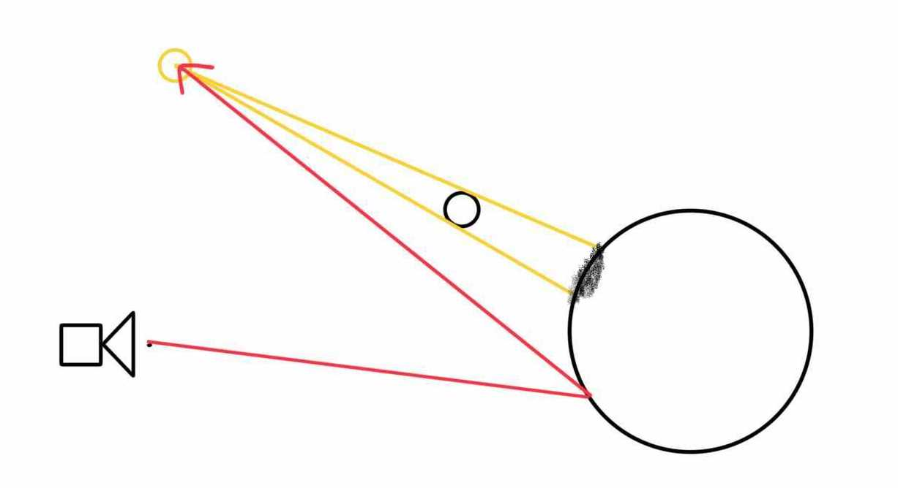
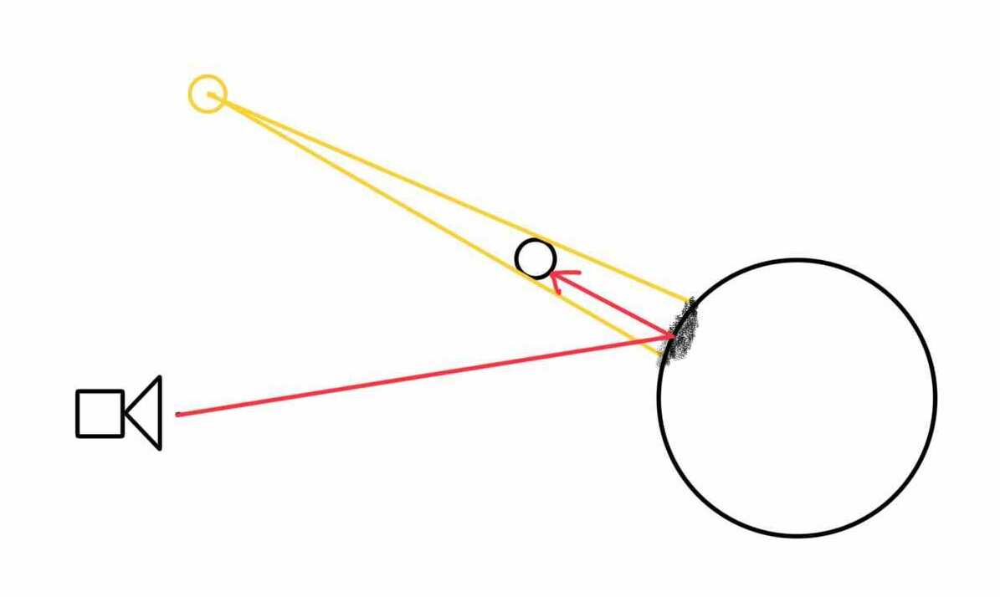
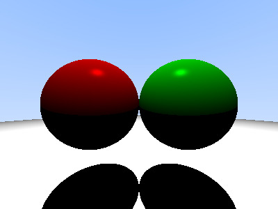

# 9. Hard Shadow

이번 장에서는 hard shadow를 구현한다.

## 9.1. 실습목표

> 1.  object와 light 사이에 또 다른 object가 존재할 때에 그림자가 발생하는데 이 그림자를 구현할 수 있다.

## 9.2. shadow

8단원에서는 phong lighting model을 적용하여 빛을 구현했다. 하지만 빛이 있으면 반대로 그림자도 존재하는 법. hit point와 광원 사이를 가로막는 object가 있으면 그림자를 적용할 것이다. 실제 현실에서의 그림자는 soft shadow지만 우리는 hard shadow를 구현할 것이다.



**이미지1. not_in_shadow**



**이미지2. in_shadow**

그럼 먼저 `in_shadow`라는 함수를 만들어 보자.

```c
t_bool          in_shadow(t_object *objs, t_ray light_ray, double light_len)
{
    t_hit_record rec;

    rec.tmin = 0;
    rec.tmax = light_len;
    if (hit(objs, &light_ray, &rec))
        return (TRUE);
    return (FALSE);
}
```

**_Code1 : [miniRT/src/trace/ray/phong_lighting.c]_**

hit_point에서 부터 광원의 원점을 향해 ray를 쏴준다. 이를 `light_ray`라 한다. `light_ray` 가 object에 가로막히게 되면 hit_point가 그림자 안에 존재하는 것이다. `rec.tmax`는 hit point로 부터 광원의 원점까지의 거리 `light_len` 이어야 한다. `rec.tmax`를 `light_len` 보다 길게 잡을 경우 광원 뒤에 다른 오브젝트가 있을 때조차 shadow가 생기는 기현상이 발생할 수 있기 때문이다.

## 9.3. shadow 적용

이제 in_shadow함수를 만들었으니 이를 다른 함수에 적용시켜보자.

```c
...
t_color3        point_light_get(t_scene *scene, t_light *light)
{
    t_color3    ambient;
    t_color3    diffuse;
    t_color3    specular;
    t_vec3      light_dir;
    /* * * * 추가 * * * */
    double      light_len;
    t_ray       light_ray;
    /* * * * 추가 끝 * * * */
    t_vec3      view_dir;
    t_vec3      reflect_dir;

    ...

    double      spec;
    double      brightness;
    /* * * * 수정 * * * */
    light_dir = vminus(light->origin, scene->rec.p);
    light_len = vlength(light_dir);
    light_ray = ray(vplus(scene->rec.p, vmult(scene->rec.normal, EPSILON)), light_dir);
    if (in_shadow(scene->world, light_ray, light_len))
        return (color3(0,0,0));
    light_dir = vunit(light_dir);
    /* * * * 수정 끝 * * * */
    view_dir = vunit(vmult(scene->ray.dir, -1));

    ...
```

**_Code2 : [miniRT/src/trace/ray/phong_lighting.c]_**

`in_shadow` 함수를 trace.h헤더에 추가한다.

```c
t_color3    point_light_get(t_scene *scene, t_light *light);
/* * * * 추가 * * * */
t_bool      in_shadow(t_object *objs, t_ray light_ray, double light_len);
/* * * * 추가 끝 * * * */

// trace/hit/
t_bool      hit(t_object *obj, t_ray *ray, t_hit_record *rec);
```

**_Code3 : [miniRT/include/trace.h]_**

이번 단원에서 구현한 shadow를 확인하기 위해 `scene_init` 함수를 수정하자.

```c
scene->camera = camera(&scene->canvas, point3(0, 0, 0));
    world = object(SP, sphere(point3(-2, 0, -5), 2), color3(0.5, 0, 0)); // world 에 구1 추가
    /* * * * 추가 * * * */
    oadd(&world, object(SP, sphere(point3(0, -1000, 0), 995), color3(1, 1, 1))); // world 에 구3 추가
    /* * * * 추가 끝 * * * */
    oadd(&world, object(SP, sphere(point3(2, 0, -5), 2), color3(0, 0.5, 0))); // world 에 구2 추가
    scene->world = world;
    /* * * * 추가 * * * */
    lights = object(LIGHT_POINT, light_point(point3(0, 20, 0), color3(1, 1, 1), 0.5), color3(0, 0, 0)); // 더미 albedo
    /* * * * 추가 끝 * * * */
    scene->light = lights;
    return (scene);
```

**_Code4 : [miniRT/src/main.c]_**

이번 단원의 결과물은 다음과 같다.



**이미지3. 그림자 적용한 결과**
